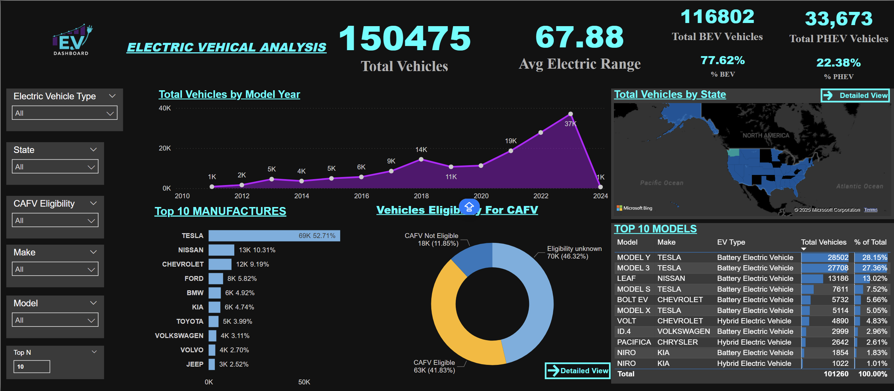

# PowerBI-EV-Analysis-ASSIGNMENT-Ashutosh-Kaleron-

## 🚀 Project Overview
This project involves a comprehensive analysis of the Electric Vehicle (EV) population dataset. The goal was to transform raw data into an interactive, futuristic, and user-friendly dashboard using **Microsoft Power BI**. 

The dashboard provides insights into market size, adoption trends, manufacturer dominance, and Clean Alternative Fuel Vehicle (CAFV) eligibility. It features a custom **Dark/Neon UI** with "App-like" navigation buttons.

---

## 📊 Key Features & Visuals

### 1. **Executive KPIs (Neon Cards)**
- **Total Vehicles:** 150,000+ tracked vehicles.
- **Average Electric Range:** 67.88 km.
- **Market Split:** Dynamic calculation of Battery Electric Vehicles (**BEV - 77%**) vs. Plug-in Hybrid Vehicles (**PHEV - 22%**).

### 2. **Advanced Data Visualization**
- **Growth Trend:** Area chart showing the explosion of EV adoption from 2010 to present.
- **Geographic Analysis:** USA Shape Map with a custom **Grey-to-Cyan Gradient** heat map to visualize vehicle density.
- **Dynamic Ranking:** A "Top 10 Manufacturers" chart controlled by a **Dynamic Parameter**, allowing users to toggle the number of brands shown.
- **Comparative Table:** Detailed model breakdown using **Conditional Formatting Data Bars** for quick visual comparison.

### 3. **UI/UX & Navigation**
- **Futuristic Theme:** Custom Black & Cyan color palette.
- **Navigation System:** Interactive buttons that allow users to drill down into "Detailed Maps" and "CAFV Analysis" pages.
- **Sidebar Filters:** A clean, vertical slicer panel for filtering by State, Make, Model, and Eligibility.

---

## 🛠️ Technical Implementation

This project utilizes advanced Power BI features:

*   **Data Cleaning (Power Query):**
    *   Standardized `EV Type` names (BEV/PHEV).
    *   Parsed geospatial data (Splitting `POINT` coordinates).
    *   Created Grouping Bins for simplified analysis.
*   **DAX (Data Analysis Expressions):**
    *   `RANKX` & Parameters for the **Dynamic Top N Filter**.
    *   `CALCULATE` & `ALLSELECTED` for relative **% Share** measures.
*   **Visualization:**
    *   Custom Gradient Legend creation.
    *   Button Actions for Page Navigation.

---

## 📂 How to Run
1.  **Download** the `.pbix` file from this repository.
2.  Open it in **Microsoft Power BI Desktop**.
3.  **Interact:**
    *   Use `Ctrl + Click` on the **"Detailed View"** buttons to navigate.
    *   Use the **"Top N"** input box to change the ranking charts.

---

### 👤 Author
**Ashutosh Kaleron**  
